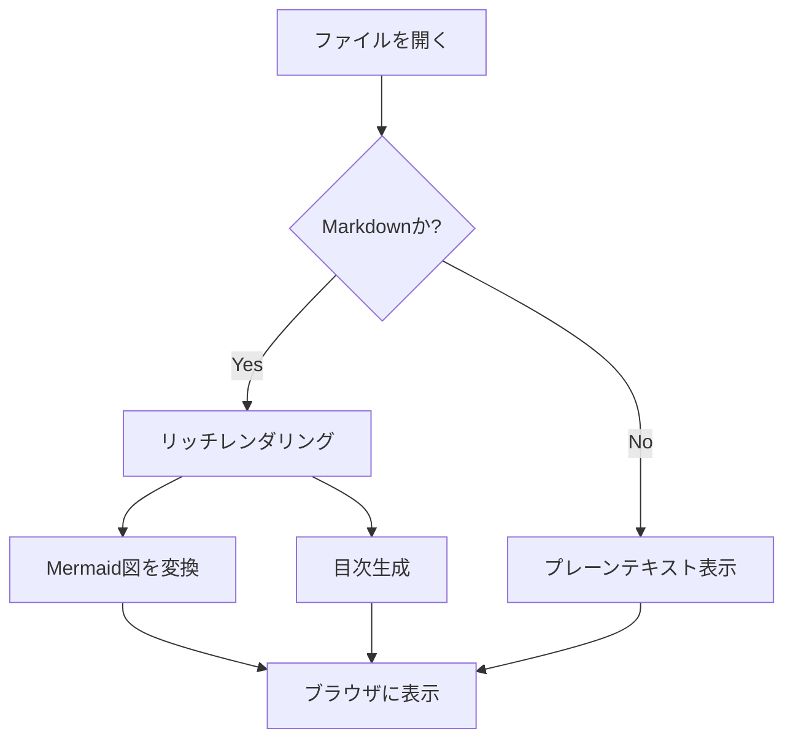
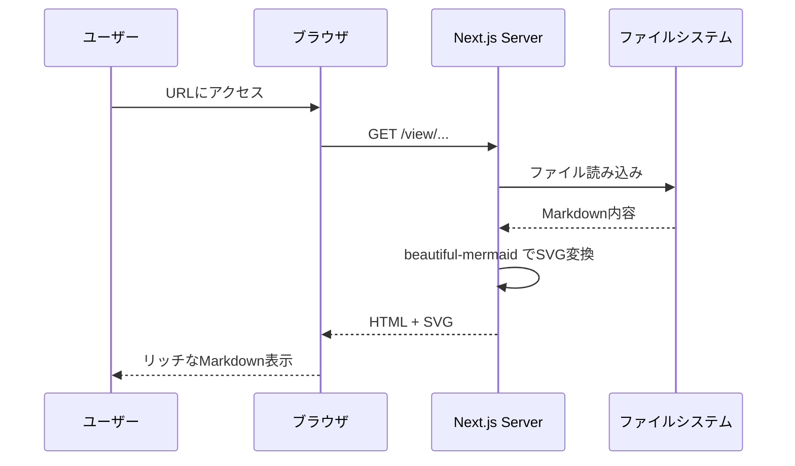
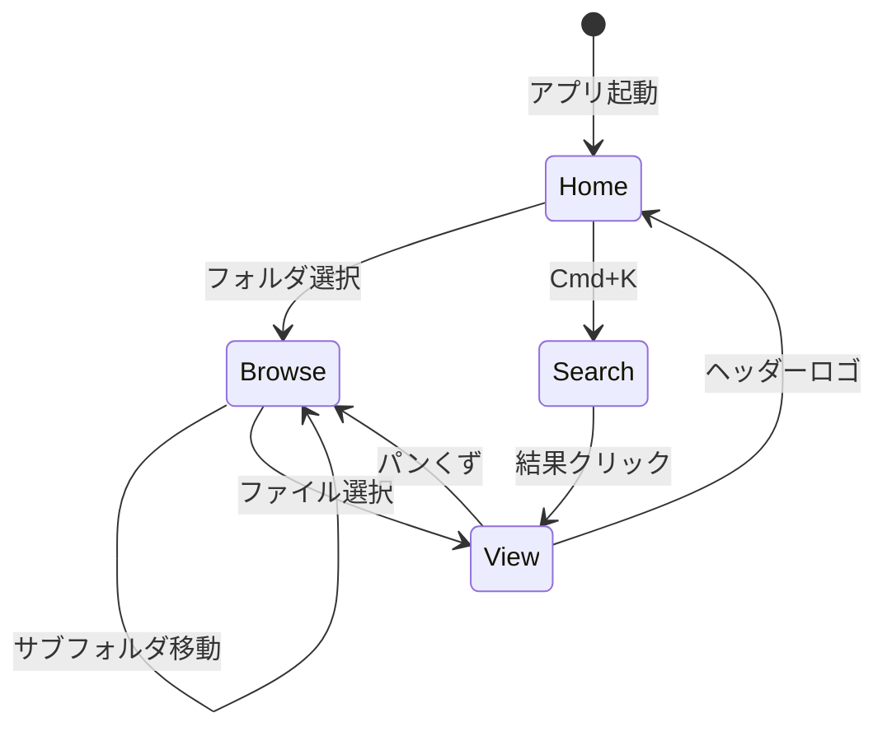
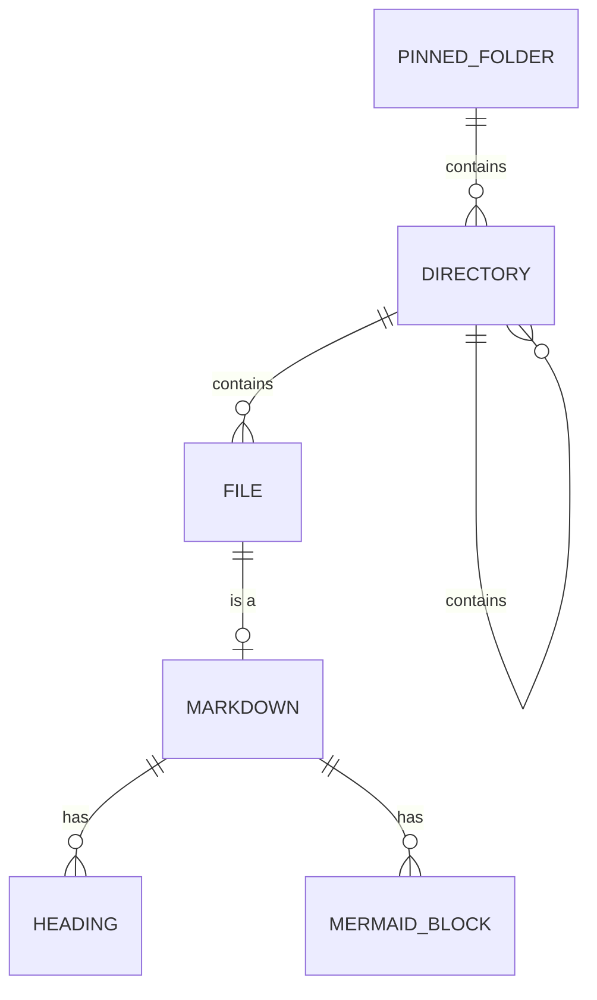

# mado サンプルページ
> このファイルは mado のMarkdownレンダリング機能をデモするためのサンプルです。

## テキスト表示

通常のテキストは **LINE Seed JP** フォントで表示されます。行間は `line-height: 1.85` に設定されており、日本語の長文を快適に読めるようになっています。

**太字**、*斜体*、~~取り消し線~~、`インラインコード` がサポートされています。

[リンクはこのように表示されます](https://example.com)。下線のオフセットが調整されており、文字にかぶりません。

---

## 見出しの階層

### h3 見出し

見出しにはアンカーIDが自動付与され、目次（右下の浮遊ボタン）からジャンプできます。h2には下線ボーダーが表示されます。

### もう一つのh3

見出し間の余白は h2 が `2.5em`、h3 が `2em` で、セクションの区切りが視覚的に明確です。

---

## リスト

### 箇条書き

- 項目1: 各項目の間隔は `0.35em` に調整
- 項目2: 長い項目の場合も行間 `1.75` で読みやすい
  - ネストされた項目もサポート
  - 深い階層でもインデントが効く
- 項目3

### 番号付きリスト

1. 最初のステップ
2. 次のステップ
3. 最後のステップ

### タスクリスト

- [x] 完了したタスク
- [ ] 未完了のタスク
- [ ] もう一つの未完了タスク

---

## テーブル

| 機能 | 対応状況 | 備考 |
|------|:--------:|------|
| GFM | o | GitHub Flavored Markdown |
| Mermaid | o | beautiful-mermaid でレンダリング |
| 数式 | - | 未対応 |
| 画像 | - | プレビュー未対応 |

---

## コードブロック

```typescript
// TypeScript のシンタックスハイライト例
interface MadoConfig {
  folders: PinnedFolder[];
}

async function markdownToHtml(markdown: string): Promise<string> {
  const result = await unified()
    .use(remarkParse)
    .use(remarkGfm)
    .process(markdown);
  return String(result);
}
```

```json
{
  "folders": [
    { "id": "notes", "label": "Notes", "path": "~/Notes", "icon": "pen" }
  ]
}
```

---

## 引用

> これは引用ブロックです。`font-style: normal` に設定されており、
> 日本語でも自然に表示されます。引用元の色は `muted-foreground` です。

---

## Mermaid 図（beautiful-mermaid）

### フローチャート



### シーケンス図



### 状態遷移図



### ER図



---

## 長い段落のテスト

mado（窓）は、ローカルファイルシステムをブラウザから快適に閲覧するためのツールです。特にMarkdownファイルの表示に最適化されており、GFM（GitHub Flavored Markdown）の完全サポートに加え、Mermaid図のレンダリングにも対応しています。スマートフォンからのアクセスにも配慮した設計で、QRコードによる簡単接続、フローティング目次、レスポンシブなテーブル表示などのモバイルファースト機能を備えています。

フォントには LINE Seed JP を採用しています。LINEが自社ブランドのために設計したこのフォントは、ジオメトリックなデザインでありながら温かみがあり、日本語の可読性に優れています。行間は1.85に設定されており、一般的なWebのベストプラクティス（1.6-1.9）の範囲内で、日本語の密度に合わせてやや広めに取っています。

---

## フッター

このサンプルファイルの内容は `public/sample.md` に配置されています。`mado.config.json` の `folders` にこのプロジェクトディレクトリを追加すると、mado からこのファイルにアクセスできます。
