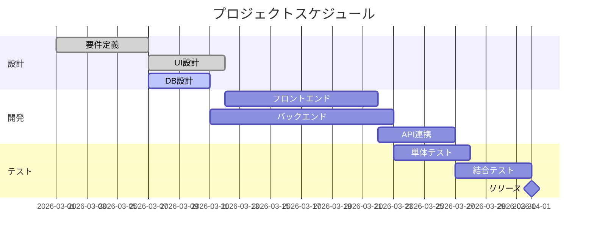
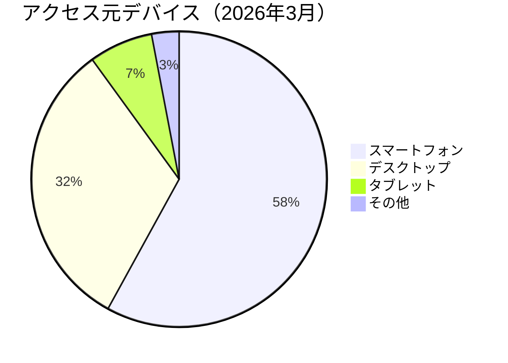
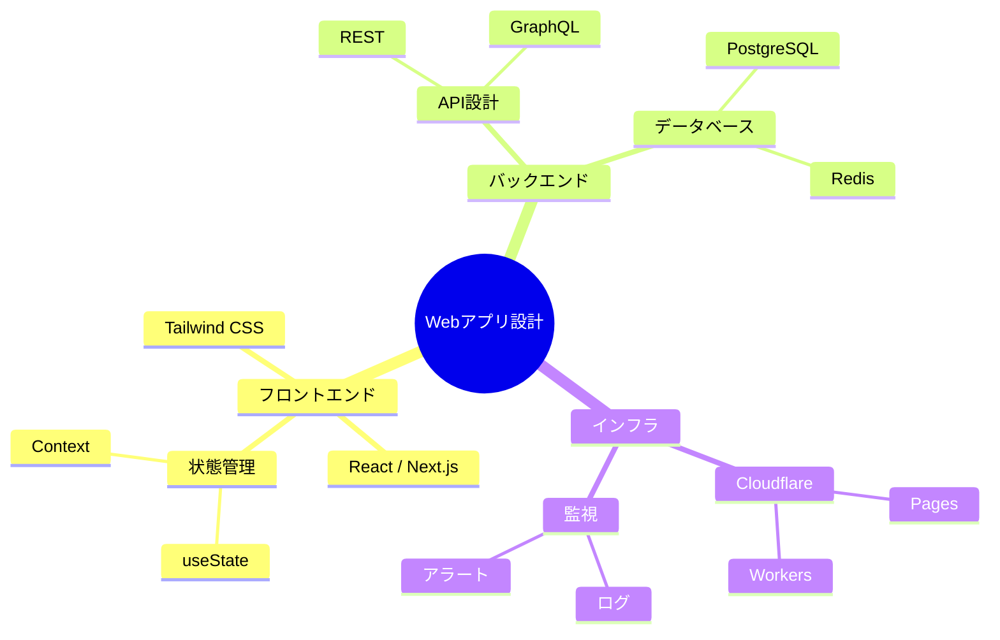
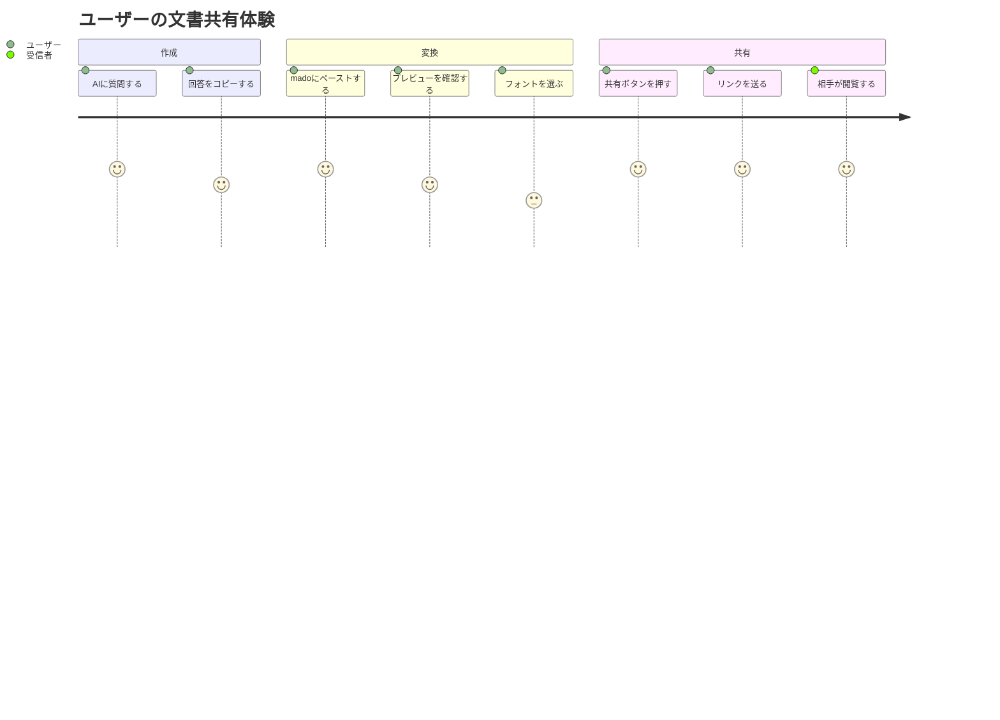
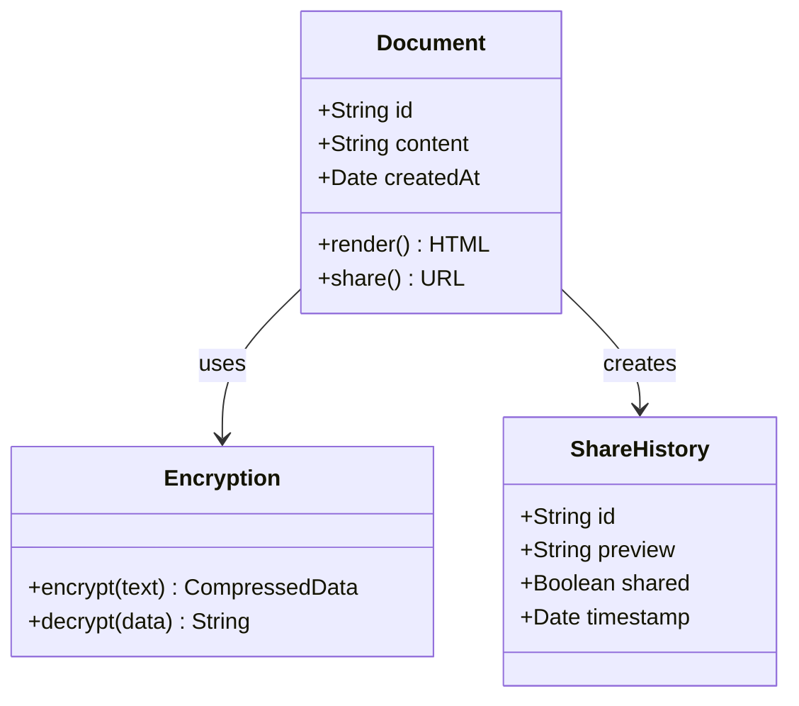
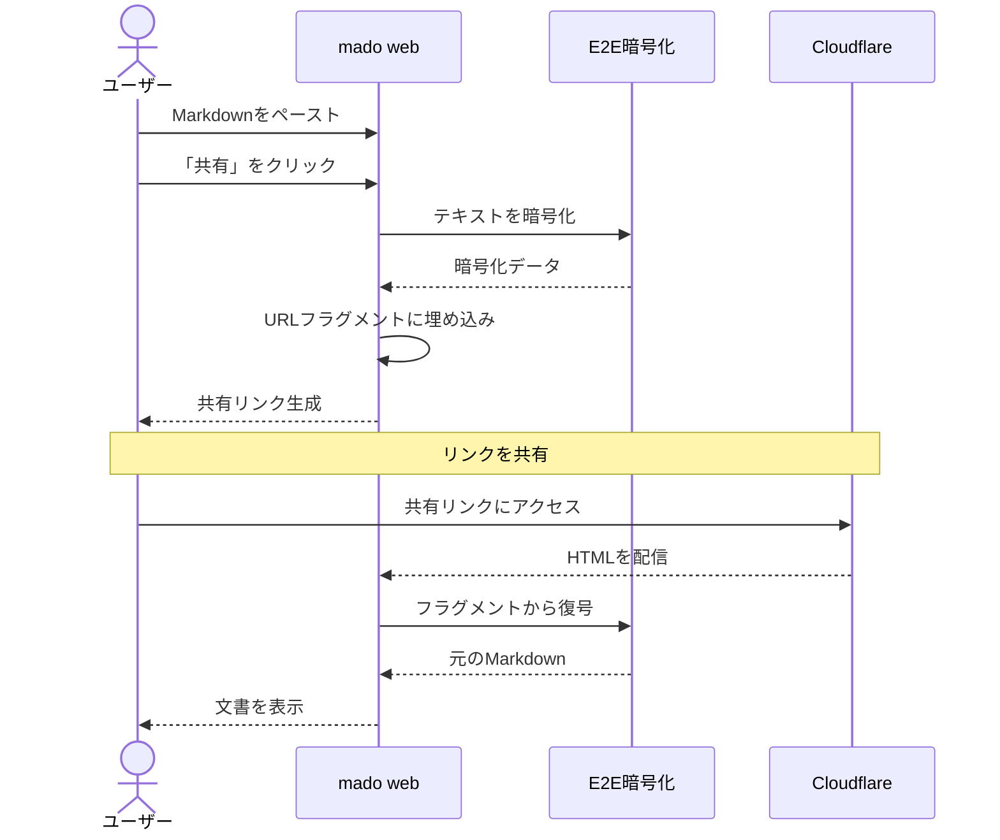

# Mermaid 図解ショーケース

> mado が対応している Mermaid 図の種類を紹介します。

---

## ガントチャート

```mermaid
gantt
    title プロジェクトスケジュール
    dateFormat  YYYY-MM-DD
    section 設計
    要件定義      :done, des1, 2026-03-01, 2026-03-07
    UI設計        :done, des2, after des1, 5d
    DB設計        :active, des3, after des1, 4d
    section 開発
    フロントエンド :dev1, after des2, 10d
    バックエンド   :dev2, after des3, 12d
    API連携       :dev3, after dev1, 5d
    section テスト
    単体テスト    :test1, after dev2, 5d
    結合テスト    :test2, after dev3, 5d
    リリース      :milestone, after test2, 0d
```

---

## パイ図（円グラフ）

```mermaid
pie title アクセス元デバイス（2026年3月）
    "スマートフォン" : 58
    "デスクトップ" : 32
    "タブレット" : 7
    "その他" : 3
```

---

## マインドマップ

```mermaid
mindmap
  root((Webアプリ設計))
    フロントエンド
      React / Next.js
      Tailwind CSS
      状態管理
        useState
        Context
    バックエンド
      API設計
        REST
        GraphQL
      データベース
        PostgreSQL
        Redis
    インフラ
      Cloudflare
        Pages
        Workers
      監視
        ログ
        アラート
```

---

## ジャーニーマップ

```mermaid
journey
    title ユーザーの文書共有体験
    section 作成
      AIに質問する: 5: ユーザー
      回答をコピーする: 4: ユーザー
    section 変換
      madoにペーストする: 5: ユーザー
      プレビューを確認する: 4: ユーザー
      フォントを選ぶ: 3: ユーザー
    section 共有
      共有ボタンを押す: 5: ユーザー
      リンクを送る: 5: ユーザー
      相手が閲覧する: 5: 受信者
```

---

## クラス図

```mermaid
classDiagram
    class Document {
        +String id
        +String content
        +Date createdAt
        +render() HTML
        +share() URL
    }
    class ShareHistory {
        +String id
        +String preview
        +Boolean shared
        +Date timestamp
    }
    class Encryption {
        +encrypt(text) CompressedData
        +decrypt(data) String
    }
    Document --> Encryption : uses
    Document --> ShareHistory : creates
```

---

## シーケンス図

```mermaid
sequenceDiagram
    actor User as ユーザー
    participant App as mado web
    participant Crypto as E2E暗号化
    participant CF as Cloudflare

    User->>App: Markdownをペースト
    User->>App: 「共有」をクリック
    App->>Crypto: テキストを暗号化
    Crypto-->>App: 暗号化データ
    App->>App: URLフラグメントに埋め込み
    App-->>User: 共有リンク生成

    Note over User,CF: リンクを共有

    User->>CF: 共有リンクにアクセス
    CF-->>App: HTMLを配信
    App->>Crypto: フラグメントから復号
    Crypto-->>App: 元のMarkdown
    App-->>User: 文書を表示
```
