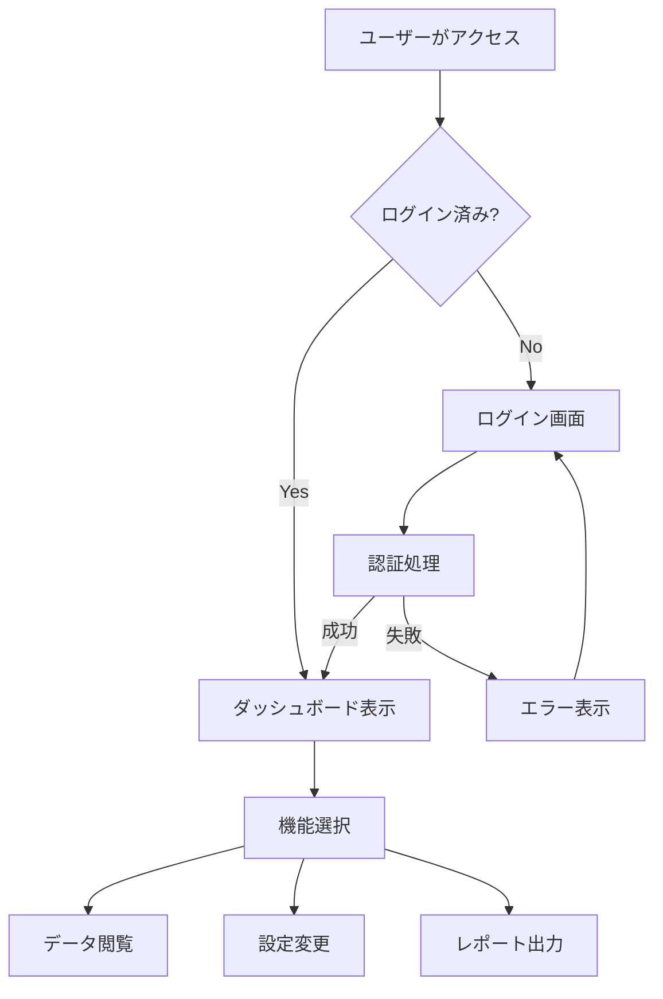
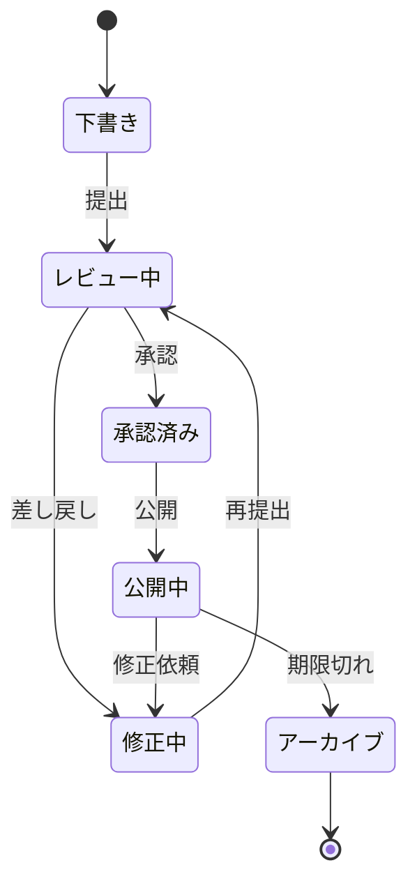
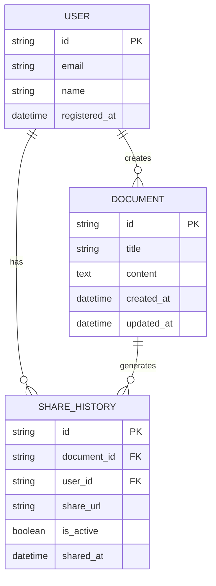
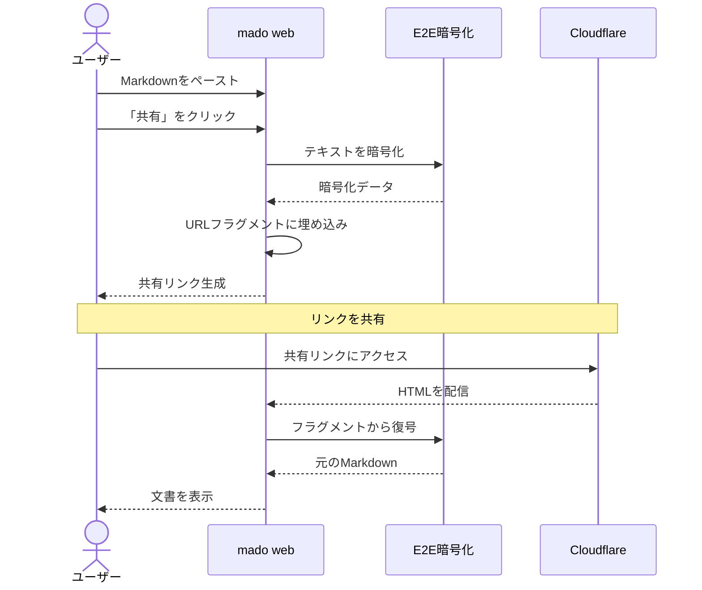

# Mermaid 図解ショーケース

> mado が対応している Mermaid 図の種類を紹介します。

---

## フローチャート



---

## 状態遷移図



---

## ER図



---

## XYチャート

```mermaid
xychart-beta
    title "月別アクセス数（2026年）"
    x-axis [1月, 2月, 3月, 4月, 5月, 6月]
    y-axis "アクセス数" 0 --> 5000
    bar [1200, 1800, 3200, 2800, 4100, 4500]
    line [1200, 1800, 3200, 2800, 4100, 4500]
```

---

## クラス図


---

## シーケンス図


