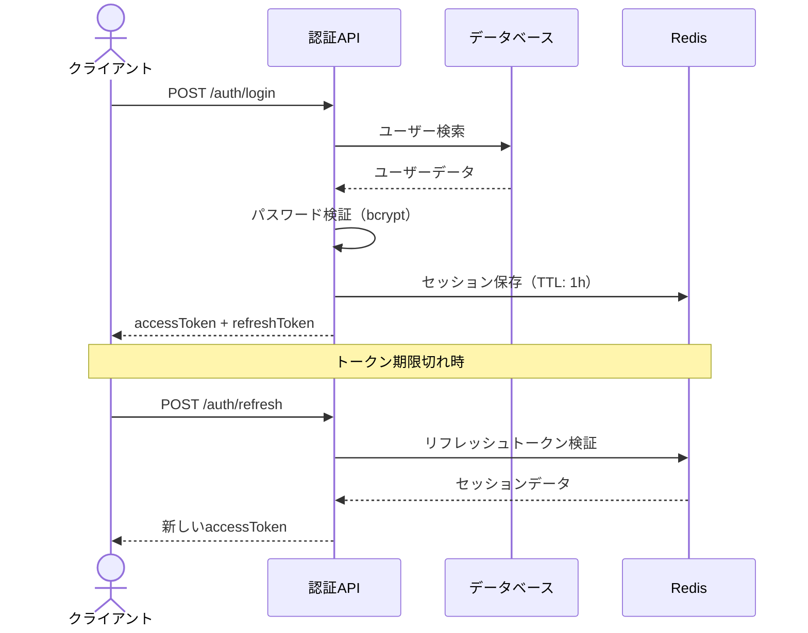

# ユーザー認証 API 仕様書

> バージョン: v2.1 | 最終更新: 2026-03-14

---

## エンドポイント一覧

| メソッド | パス | 説明 | 認証 |
|---------|------|------|------|
| POST | `/api/auth/login` | ログイン | 不要 |
| POST | `/api/auth/register` | ユーザー登録 | 不要 |
| POST | `/api/auth/refresh` | トークン更新 | リフレッシュトークン |
| DELETE | `/api/auth/logout` | ログアウト | アクセストークン |
| GET | `/api/auth/me` | ユーザー情報取得 | アクセストークン |

---

## POST `/api/auth/login`

### リクエスト

```json
{
  "email": "user@example.com",
  "password": "SecureP@ss123"
}
```

### レスポンス（成功: 200）

```json
{
  "accessToken": "eyJhbGciOiJIUzI1NiIs...",
  "refreshToken": "dGhpcyBpcyBhIHJlZnJl...",
  "expiresIn": 3600,
  "user": {
    "id": "usr_abc123",
    "email": "user@example.com",
    "name": "田中太郎",
    "role": "member"
  }
}
```

### エラーレスポンス

| ステータス | コード | 説明 |
|-----------|--------|------|
| 400 | `INVALID_REQUEST` | リクエスト形式が不正 |
| 401 | `INVALID_CREDENTIALS` | メールまたはパスワードが不正 |
| 429 | `RATE_LIMITED` | リクエスト制限（5回/分） |
| 500 | `INTERNAL_ERROR` | サーバーエラー |

---

## 認証フロー



---

## 実装例

```typescript
// middleware.ts — 認証ミドルウェア
import { verify } from "jsonwebtoken";
import type { NextRequest } from "next/server";

const PUBLIC_PATHS = ["/api/auth/login", "/api/auth/register"];

export function middleware(request: NextRequest) {
  if (PUBLIC_PATHS.includes(request.nextUrl.pathname)) {
    return; // 認証不要パス
  }

  const token = request.headers.get("Authorization")?.replace("Bearer ", "");
  if (!token) {
    return Response.json({ error: "UNAUTHORIZED" }, { status: 401 });
  }

  try {
    const payload = verify(token, process.env.JWT_SECRET!);
    // リクエストヘッダーにユーザー情報を付与
    request.headers.set("x-user-id", (payload as { sub: string }).sub);
  } catch {
    return Response.json({ error: "TOKEN_EXPIRED" }, { status: 401 });
  }
}
```

---

## レート制限

| エンドポイント | 制限 | ウィンドウ |
|-------------|------|----------|
| `/auth/login` | 5回 | 1分 |
| `/auth/register` | 3回 | 10分 |
| `/auth/refresh` | 10回 | 1分 |
| その他 | 100回 | 1分 |

429 レスポンス時は `Retry-After` ヘッダーを確認してください。
